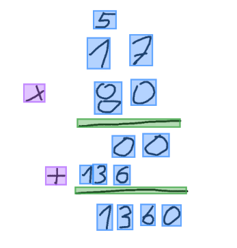
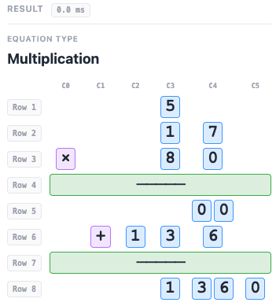
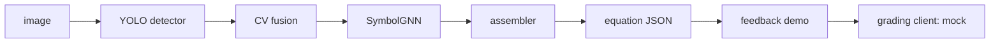

# Handwritten Arithmetic Recognition

Reads a photo or tablet drawing of handwritten column arithmetic and returns its structure as JSON: every symbol, its row and column, and the kind of equation. It reads the work exactly as drawn and never corrects it.

Group project, Fontys University of Applied Sciences (AI specialisation, 2026), built with an education-technology partner for children aged 6 to 12.

> Shared as a reference. Not actively maintained for external contributions.

| Detection (stage 1) | Structured result (stages 2 and 3) |
|---|---|
|  |  |

## What it does

| Stage | Method | Output |
|---|---|---|
| 1. Detect | YOLOv8 finds symbol boxes in 6 roles (main digit, carry, borrow, operator, result bar, division bracket); a classical OpenCV detector recovers boxes YOLO misses on sparse or unfinished work | bounding boxes |
| 2. Structure | a two-stream GATv2 graph network (`SymbolGNN`) predicts each symbol's label, row, column and the equation type | per-symbol predictions |
| 3. Assemble | formats predictions into schema-versioned JSON; flags spurious carries instead of deleting them; rejects empty or operator-only scribbles as out of distribution | equation JSON ([schema](data/eval/SCHEMA.md)) |

Supported layouts: addition, subtraction with borrows, multiplication with partial products, short division and long division.

Training data is generated: a synthesiser composes scenes from public handwriting glyph sets (CROHME, EMNIST), so no manual annotation is needed. A set-maker web tool collects and labels real scenes for fine-tuning.

**Results** on a 190-scene real-handwriting set (not included in this repository): row accuracy 0.854, column accuracy 0.792, equation-kind accuracy 0.547. Structure is strong; operator recognition is the known gap (addition 0.36, subtraction 0.11).

A feedback demo (FastAPI + Konva) lets a child solve an exercise on a canvas; the recognizer reads it and a swappable grading client scores it. It ships with an in-process mock of the grading engine, so it runs fully offline.

## Quickstart

Requires Python 3.12.

```bash
git clone https://github.com/nbaburov/handwritten-arithmetic-recognition.git
cd handwritten-arithmetic-recognition
./scripts/setup_venv.sh
export PP="$(pwd)"

PYTHONPATH="$PP" .venv/bin/python -m src --help
PYTHONPATH="$PP" .venv/bin/python -m pytest tests/ -q               # about 1,500 tests
PYTHONPATH="$PP" .venv/bin/python -m src eval --project-root "$PP"   # bundled 37-sample eval bank
PYTHONPATH="$PP" .venv/bin/python -m src demo --project-root "$PP"   # http://127.0.0.1:7900
```

Model weights are not included. Generate data and train with `python -m src generate` and `python -m src train --stage yolo|gnn`; the full workflow is in [docs/runbook.md](docs/runbook.md).

## Architecture



| Package | Responsibility |
|---|---|
| `src/generation` | synthetic scene generation from glyph pools |
| `src/modeling`, `src/training` | YOLO and GNN models and training loops |
| `src/inference` | end-to-end pipeline and a Gradio GUI |
| `src/parsing` | the assembler |
| `src/eval` | evaluation harness, metrics and regression gate |
| `src/setmaker` | tool for collecting and labelling real scenes |
| `src/grading`, `src/demo` | grading-client protocol, offline mock and the feedback demo |

More: [docs/architecture.md](docs/architecture.md), [docs/models/gnn.md](docs/models/gnn.md), [docs/models/yolo.md](docs/models/yolo.md), [docs/cases.md](docs/cases.md), [docs/development.md](docs/development.md).

## Configuration

Everything is in [`config.toml`](config.toml), with every non-trivial value justified in [docs/config-rationale.md](docs/config-rationale.md). No environment variables or secrets are needed.

## Authors

N. B., N. N. and T. v. d. P. (Fontys University of Applied Sciences).

## License

Apache-2.0: see [LICENSE](LICENSE).
