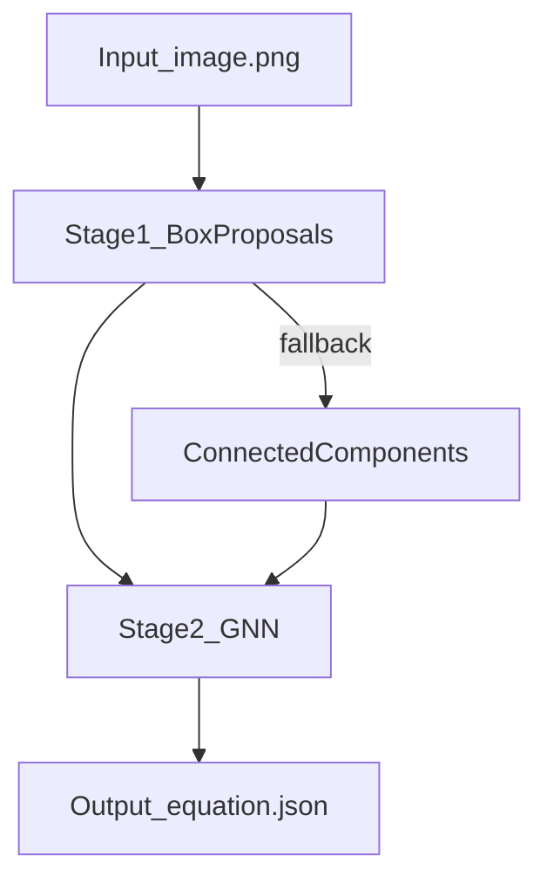
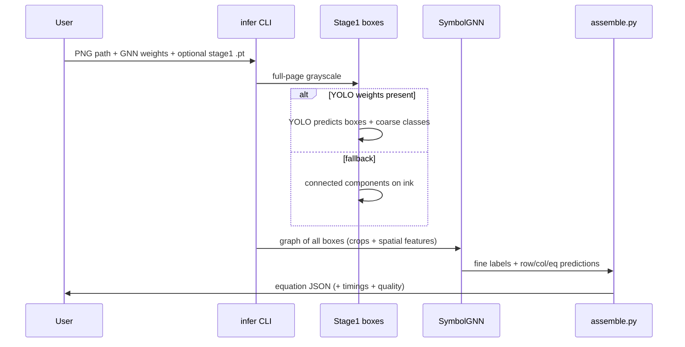

# Architecture

## Product context

### Problem statement

The system reads a static bitmap image of a digital whiteboard canvas on which a child (aged 6–12) has handwritten a multi-row arithmetic problem (addition, subtraction, multiplication, or division involving multi-digit numbers, carries, borrowing, and results) and emits a structured JSON describing every symbol's label, row, column, and equation type.

**Target audience:** children aged 6–12 writing on tablets.

**Input:** static PNG images from a tablet canvas (RGBA, RGB, or grayscale).

**Key requirements:**

- **Efficiency:** very low latency, CPU-only execution.
- **Scalability:** high-throughput server-side processing for concurrent requests.
- **Incremental updates:** the system re-evaluates the entire scene when the input changes (after an erasure or a new stroke).
- **Output structure:** structured JSON mapping every detected symbol to a specific row and column position, identifying carry and borrow digits separately from main digits, and labelling structural anchors such as result bars and division brackets.

**Out of scope:** solving the equations; providing feedback to the student.

### Data strategy

The system relies on a synthetic data generator to produce ground-truth YOLO training scenes automatically, eliminating manual annotation. Each synthetic scene is a 512×512 image with YOLO bounding-box labels derived from the generation parameters. Real handwriting crops (EMNIST-derived, 14 label folders) serve as the glyph pool from which synthetic scenes are assembled. The GNN trains on scene graphs built from those same synthetic images.

---

## Simple

The system turns a handwritten equation image into **structured JSON** using two stages:
1) find symbol boxes, 2) classify and spatially structure them with a GNN.

## Diagram



## Technical

### Stage 1: box proposals ("where")
- Prefer **YOLO** when `--stage1-weights` is provided for `infer`.
- If YOLO is unavailable/empty/fails, inference falls back to **connected components**.

### Stage 1.5: CV-fusion augmentation ("recover what YOLO missed")

After the first YOLO pass returns at least one detection, a classical OpenCV fusion step (`run_cv_fusion()` in `src/inference/cv_fusion.py`) runs before the graph is built. Its job is to recover symbols that YOLO misses or suppresses on unfinished or crowded scenes, such as a small carry digit that sits inside a looser main-digit box. It augments YOLO and never replaces it; the GNN, the output schema, and all training are untouched. The CV branch runs on the same preprocessed 512×512 grayscale image as YOLO, so its boxes share the YOLO and GNN coordinate frame (an earlier raw-image path that caused a coordinate-space mismatch on non-512 inputs was removed).

How it works:

1. **Mask YOLO ink.** The step removes YOLO's own symbol ink from the image. By default it masks only the largest connected component inside each YOLO box, so smaller separate ink (a carry written inside a loose bounding box) is left behind for the detector to find.
2. **Connected-component detection on the leftover.** A classical connected-component detector runs over the masked image with fine-grained settings, so it returns individual symbols rather than merged blobs.
3. **Batched reclassification.** The recovered crops are labelled in a single batched YOLO call. Crops YOLO cannot confidently classify are kept with a fallback label so the GNN still sees them.
4. **NMS merge.** A class-agnostic non-maximum-suppression pass merges the recovered boxes with the first-pass YOLO detections; on ties the first-pass YOLO detection wins. A small box that sits inside a larger one (a carry inside a main digit) is preserved rather than suppressed.

The merged detection list goes to the GNN unchanged.

**Modes.** CV fusion runs by default (`config.toml [inference.cv_fusion] mode = "on"`). The three modes are `on` (always fuse), `auto` (skip the CV work when YOLO already looks complete, meaning at least `gate_min_detections` high-confidence detections), and `off` (disable). It can be disabled for a single run with the CLI flag `--cv-fusion off`, or permanently with `mode = "off"` in config.

**Config defaults.** Settings live in `[inference.cv_fusion]` in `config.toml` and load into `CvFusionConfig` (`src/core/run_config.py`). The dataclass defaults are now kept in sync with `config.toml` and a config-vs-dataclass drift test guards them. The shipped defaults are `mode = "on"` and `keep_unclassified = false`; kept-but-unclassified component proposals must also pass an ink-density floor (`keep_min_ink_frac = 0.10`, dark-pixel fraction inside the box) so faint speckle is not promoted into phantom GNN nodes.

**Degrade-safe.** If the cv2 import fails, the original YOLO detections pass through unchanged, so the pipeline never breaks because OpenCV is unavailable.

**Debug overlays.** Setting the opt-in `AK_CV_DEBUG=1` environment variable dumps three PNGs to `/tmp/cv_debug` on each inference: the pipeline input, the masked leftover the CV detector searches, and an overlay showing YOLO boxes, CV candidates, and the CV detections that were kept.

### Assembler: recognize-as-drawn, never correct

The assembler (`src/parsing/assemble.py`) is a pure formatter. It reads the GNN's predictions as-is and never corrects or overrides the equation content:

- **GNN `eq_type` head is final.** The operator-majority vote and divide-vote heuristics are diagnostic observability fields computed only when `config.toml [parsing] assembler_heuristic_enabled = true` (defaults `false`). They never mutate `equation_kind`.
- **Carries and borrows with no main digit are flagged, not deleted.** A token with no same-column main digit gets `carry_conflict=true` in the output slot; it is kept.
- **Structure-only scenes** (bare digits, lone result bar, lone division bracket) emit populated `rows`/`slots` with `equation_kind="bare_digits"`.
- **OOD gate (anti-hallucination only):** zero-detection scenes (`ood_reason="true_empty"`) and digitless operator-only scribbles (`ood_reason="no_digits"`) return `equation_kind="unknown"` with empty `rows`. All other inputs, including wrong answers, partial equations, and missing structural tokens, are parsed as drawn.

### Stage 2: GNN classification and parsing ("what + arrange")
- A GATv2-based `SymbolGNN` (two-stream architecture) jointly predicts fine label, row index, column index, and equation type for every detected symbol.
- A `CropBackbone` CNN encodes each 28×28 crop into a 128-dim visual embedding; spatial features (5 geometric coords + confidence + importance) are processed separately.
- **Two-stream design:** visual stream processes the full 141-dim input (128 visual + 13 spatial features) through GATv2 layers and produces fine_label and edge_type predictions. Spatial stream processes 7-dim input (geometry + metadata, role one-hot stripped) through separate GATv2 layers and produces row/col/ordinal predictions. Spatial stream isolation achieves operator independence by design. Optional scene virtual node carries 8-dim scene summary and feeds into equation_type prediction when enabled via `config.toml [gnn] use_scene_virtual_node`.
- The GNN replaces both the old CNN classifier and the old rule-based parser.

## End-to-end flow

### Sequence diagram



### Step by step
1. **Load image** → grayscale array ([`inference/run.py`](../src/inference/run.py)).
2. **Stage 1 proposals** — either Ultralytics **YOLO** (`--stage1-weights`) or **connected-component** blobs if YOLO missing/fails/empty.
2.5. **Stage 1.5 CV fusion** — when YOLO returns at least one detection and `config.toml [inference.cv_fusion] mode != "off"`, `run_cv_fusion()` ([`cv_fusion.py`](../src/inference/cv_fusion.py)) recovers symbols YOLO missed on unfinished scenes via connected components over unclaimed ink, reclassifies the crops with a batched YOLO pass, and class-agnostic-NMS-merges them into the proposal set. This augments YOLO without replacing it and is degrade-safe (cv2 import failure leaves the YOLO detections unchanged). Disable per-run with `--cv-fusion off`.
3. **Graph construction** — [`graph_builder.py`](../src/modeling/graph_builder.py) builds a PyG `Data` object: 28×28 crops, 13-dim spatial node features, dense N×N edges (all ordered pairs; capped at MAX_NODES=80 by confidence).
4. **GNN inference** — `SymbolGNN` jointly predicts fine label, row cluster, col cluster, within-row/col ordinals, equation type, and edge type for every node.
5. **Assembly** — [`assemble.py`](../src/parsing/assemble.py) formats `NodePrediction` objects into the structured output JSON (pure formatter, no spatial logic).
6. **JSON** includes `quality.degraded` and `quality.reason` when proposals fell back, plus optional `debug` timings.

### Training vs inference path
| Phase | Command | Output |
|-------|---------|--------|
| Prep | `validate` | `data/generated/processed/...` |
| Synth (Stage 1 train only) | `generate` | `data/generated/synthetic/` |
| Train | `train --stage yolo\|gnn` | `artifacts/...` |
| Metrics (synthetic bank) | `eval` | `reports/eval/latest.md` |
| Metrics (real set) | `eval --samples-dir data/eval/real --config-id real` | `reports/eval/latest.md` |
| One image | `infer --image ... --output-json ...` | JSON file |

### Real-data collection and fine-tune

The set-maker is a local FastAPI + Konva web tool for building real eval and train sets. Launch with `python -m src setmaker`. It auto-generates target equations from `data/setmaker/quota.json`, lets you draw on a canvas, YOLO detects, Hungarian matching copies labels to geometry, and you fix only the flagged boxes. Exports go to `data/eval/real/` (eval mode) or `data/setmaker/train/` (train mode).

Once real training scenes are collected, merge and fine-tune:

```bash
python -m src prepare-realtrain     # merge real + synthetic for fine-tune
python -m src train --stage gnn --finetune-from-real --init-from <run_id> --lr 0.0005
python -m src train --stage yolo --finetune-from-real
python -m src eval --samples-dir data/eval/real --config-id real
```

### Feedback demo

A separate web app (the `demo` CLI subcommand: FastAPI + Konva, reusing the set-maker static stack) connects the recognizer to a grading engine. Launch with `python -m src demo`. A child solves a presented exercise on a 512x512 canvas (pen and eraser); the same preprocess, YOLO, GNN, assemble pipeline recognizes it, and a swappable `GradingClient` (`src/grading/`, selected by `config.toml [grading] mode = mock|http`) grades it. The mock (`mock_client.py`) is a high-fidelity in-process grader that mirrors the reverse-engineered grading engine `session/create` and `session/event` contract (captured under `docs/research/`), so the demo runs with no API key; the real key plugs in by switching the mode. Recognition overlay and feedback are model-first, anchored on the model's real glyph bboxes (the grid is a visual writing guide only, never used for recognition or feedback placement). Grading is structure-relative and answer-first: a correct answer written anywhere, shifted, or with a short bar still grades correct, and carry, borrow, and partial-product steps are graded on presence only. Feedback is a single verdict (correct, missing a step, mistake, or keep going) with one focus highlight, and multi-digit borrow and carry cells are graded honestly on presence. Exercise layouts are no longer hand-written: `derive.py` auto-derives the full expected-token set for any exercise from the grading engine's own `session/create` and `session/solution` responses (working in the translation-invariant native solution frame), so addition, subtraction, multiplication, short division (column arithmetic) and long division (bus-stop bracket with subtraction steps) all flow from the engine's authored exercises rather than a static bank.

The 190-scene real eval set (`data/eval/real/`, not included in this repository) (twice vision-reviewed) is the current primary measurement set. Iter11 active: row_acc 0.854, col_acc 0.792, eq_kind_acc 0.547. See [runbook.md](runbook.md) and [sharing.md](sharing.md) for the full workflow.

## Related
- [runbook.md](runbook.md) — prep → train → eval workflow, CLI reference, and GUI guide
- [models/gnn.md](models/gnn.md) — GNN architecture: CropBackbone, GATv2, multi-task loss
- [models/yolo.md](models/yolo.md) — YOLO Stage 1: detection, synthetic data strategy, results

---

## Generation knob reference

All generation knobs live in `config.toml` and are loaded through `src/core/run_config.py:load_config`. The table below covers every `[generation*]` section. For each knob the "consumed at" column names the file and line where the value is first read at runtime.

### `[generation]`

| Knob | Effect | Consumed at |
|------|--------|-------------|
| `images_per_case` | Base scene count per SceneCase before case-weight multipliers are applied | `src/generation/synth_yolo.py` (loop bound) |
| `min_instances_per_label` | Minimum crops per GNN fine-label after top-up rounds | `src/generation/synth_yolo.py` (topup gate) |
| `topup_rounds` | Maximum extra passes to satisfy `min_instances_per_label` | `src/generation/synth_yolo.py` |
| `seed` | Global RNG seed for scene generation | `src/generation/synth_yolo.py` |
| `split_train / split_val / split_test` | Scene split ratios (must sum to 1.0) | `src/generation/synth_yolo.py` |
| `source_pool` | Glyph pool selection: `"crohme"`, `"hires"`, `"clean"`, `"legacy"`, `"auto"` | `src/generation/synth_pool.py:resolve_pool_root` |
| `min_source_quality` | Minimum crop quality score (0..1); crops below this are retried up to 5 times | `src/generation/synth_pool.py:_load_tile_with_quality` |

### `[generation.completion]`

| Knob | Effect | Consumed at |
|------|--------|-------------|
| `full` | Fraction of scenes rendered with all tokens present | `src/generation/completion_stages.py:_DEFAULT_WEIGHTS` |
| `done_80` | Fraction with last ~20% of result-row digits dropped | same |
| `done_60` | Fraction with last ~40% of result-row digits dropped | same |
| `done_40` | Fraction with result row and bar dropped | same |
| `done_20` | Fraction with only operands remaining (most incomplete) | same |

Drift warning: the five bucket weights must sum to 1.0. `_DEFAULT_WEIGHTS` in `completion_stages.py` mirrors these values; if you change config.toml, the defaults in that dict should be updated in the same commit.

### `[generation.scene]`

| Knob | Effect | Consumed at |
|------|--------|-------------|
| `wrong_result_prob` | Probability of flipping one result digit to produce an arithmetically wrong equation | `src/generation/synth_yolo.py` |
| `missing_structural_prob` | Probability of dropping the bar or operator token before render | `src/generation/synth_yolo.py` |
| `wrong_operator_prob` | Probability of swapping the operator glyph for a different operator | `src/generation/synth_yolo.py` |
| `crowdness_prob` | Probability that a scene uses tight whole-canvas glyph packing (iter11: 0.45); when active, `crowding_factor` tightens horizontal pitch | `src/generation/synth_yolo.py` |
| `crowding_factor` | Glyph spacing multiplier when crowded (iter11: 0.66, tighter than 0.70); only active when `crowdness_prob` fires | `src/generation/handwriting_style.py:make_style` |
| `scene_rotation_min_deg` | Lower bound for whole-canvas rotation in degrees | `src/generation/synth_yolo.py` |
| `scene_rotation_max_deg` | Upper bound for whole-canvas rotation in degrees | `src/generation/synth_yolo.py` |

### `[generation.preset]`

| Knob | Effect | Consumed at |
|------|--------|-------------|
| `glyph_rotation_min_deg` | Per-glyph rotation lower bound (degrees) | `src/generation/handwriting_style.py:make_style` |
| `glyph_rotation_max_deg` | Per-glyph rotation upper bound (degrees) | same |
| `glyph_jitter_min_px` | Per-glyph position jitter lower bound (pixels) | `src/generation/synth_pool.py:_jitter` |
| `glyph_jitter_max_px` | Per-glyph position jitter upper bound (pixels) | same |
| `glyph_broken_stroke_prob` | Per-glyph probability of an erased horizontal band simulating a stroke gap | `src/generation/synth_pool.py:_apply_broken_stroke` |

### `[generation.case_weights]`

| Knob | Effect | Consumed at |
|------|--------|-------------|
| `<case_name>` (e.g. `division_short`) | Multiplier on `images_per_case` for that SceneCase; 1.0 = balanced | `src/generation/synth_yolo.py` (per-case image count) |

Valid case names match `SceneCase` values in `src/generation/layouts.py`.

### `[generation.rendering]`

| Knob | Effect | Consumed at |
|------|--------|-------------|
| `glyph_stroke_target_px` | Target stroke width (px) per glyph after render (iter11: 2.0 to match real input); normalised via distance-transform morphology | `src/generation/synth_pool.py` |
| `glyph_binarize_threshold` | Hard binarise threshold (iter11: 165); hard-binarise at this level to capture stroke body; 0=soft grayscale (avoided: contrast_normalise fattens strokes) | `src/generation/synth_pool.py` |
| `max_render_scale` | Canvas-fill scale cap (iter11: 5.5 reverted to legacy; glyphs ~real size); lower = smaller/sparser; raise toward 5.5 = bigger/thicker | same |
| `glyph_overflow_prob` | Per-glyph probability it overflows (bleeds into a neighbour cell, H or V); centroid stays in intended cell so row/col GT holds (iter11: 0.20) | `src/generation/layouts.py:sample_layout_for_case` |
| `glyph_overflow_scale_max` | Max scale multiplier when overflow fires (iter11: 1.35) | same |
| `glyph_overflow_shift_frac` | Max centroid shift toward neighbour as fraction of pitch; MUST stay < 0.5 so centroid remains in intended cell (iter11: 0.30) | same |
| `double_digit_cell_prob` | Per borrow/carry: probability it packs two glyphs in ONE cell, e.g. "16" (iter11 NEW: 0.30) | same |
| `carry_borrow_scale_min` | Minimum size multiplier for carry/borrow digit tiles relative to main digits | same |
| `carry_borrow_scale_max` | Maximum size multiplier for carry/borrow digit tiles | same |
| `operator_scale_min` | Minimum size multiplier for operator tiles (sampled per-token) (iter10: range replaces scalar) | same |
| `operator_scale_max` | Maximum size multiplier for operator tiles | same |
| `bar_gap_prob` | Probability of a single large mid-bar gap on result bars (replaces the removed `stroke_gap_prob`) | `src/generation/synth_pool.py` passed to `strokes.py:draw_handwritten_bar` |
| `bar_thickness_min` | Minimum stroke thickness per segment for result bars (pixels) | `src/generation/strokes.py:draw_handwritten_bar` |
| `bar_thickness_max` | Maximum stroke thickness per segment for result bars (pixels); each segment samples independently | same |
| `bar_intensity_min` | Darkest ink shade per segment on 0-255 scale (0=pure black); mimics light-pressure strokes | same |
| `bar_intensity_max` | Lightest ink shade per segment; range [min, max] gives patchy pressure variation | same |
| `bar_micro_break_prob` | Per-segment probability of a 1-2 px skip; accumulates to a jerky, dotted hand-drawn look | same |
| `bar_y_jitter_sigma` | Gaussian sigma for per-control-point vertical displacement; higher = more wavy bar | same |
| `bar_x_jitter_sigma` | Gaussian sigma for per-control-point horizontal displacement; adds lateral wander | same |
| `bracket_gap_prob` | Probability of a single large gap on the bracket horizontal arm (replaces `stroke_gap_prob`) | `src/generation/synth_pool.py` passed to `strokes.py:draw_handwritten_bracket` |
| `bracket_thickness_min` | Minimum stroke thickness per segment for division brackets (pixels) | `src/generation/strokes.py:draw_handwritten_bracket` |
| `bracket_thickness_max` | Maximum stroke thickness per segment for division brackets (pixels) | same |
| `bracket_intensity_min` | Darkest ink shade per segment for brackets | same |
| `bracket_intensity_max` | Lightest ink shade per segment for brackets | same |
| `bracket_micro_break_prob` | Per-segment micro-gap probability for brackets | same |
| `bracket_h_y_jitter_sigma` | Gaussian sigma for horizontal arm y jitter | same |
| `bracket_h_x_jitter_sigma` | Gaussian sigma for horizontal arm x jitter | same |
| `bracket_v_x_jitter_sigma` | Gaussian sigma for vertical arm x jitter | same |
| `base_cell_px` | Base glyph cell size in pixels before crowding factor is applied | `src/generation/synth_pool.py:_draw_equation_block` |
| `gap_x_min` | Minimum horizontal gap between glyph columns (pixels); sampled per scene | same |
| `gap_x_max` | Maximum horizontal gap between glyph columns (pixels) | same |
| `gap_y_min` | Minimum vertical gap between glyph rows (pixels); sampled per scene | same |
| `gap_y_max` | Maximum vertical gap between glyph rows (pixels) | same |

`done_20` in `[generation.completion]` is now an explicit knob read by `load_config`. All five completion weights must sum to 1.0; `load_config` raises `ValueError` if they do not.

---

### Hardcoded architectural constants

The following values are intentionally not config knobs. They encode structural invariants of the pipeline and should not be changed without corresponding model retraining or schema changes.

| Constant | Value | Location | Reason not a knob |
|----------|-------|----------|--------------------|
| `target_size` | 512 | `src/data_pipeline/preprocessing.py` | All models trained on 512×512; changing requires full retrain |
| `MAX_NODES` | 80 | `src/modeling/graph_builder.py`, `src/modeling/gnn.py` | GNN input dimensionality; matches `[yolo.inference] max_det` |
| `INK_BBOX_THRESHOLD` | 250 | `src/core/ink.py` | INTER_CUBIC anti-aliasing halo breadth; empirically stable |
| `INK_BINARIZE_THRESHOLD` | 165 | `src/core/ink.py` | Boldness-regression fix; tighter than legacy 200 to cut BICUBIC halo |
| `INK_DRAW_THRESHOLD` | 200 | `src/core/ink.py` | cv2.line paints at value 0; any pixel below 200 is reliably ink |
| `_BAR_CONTROL_POINTS` | 7 | `src/generation/strokes.py` | Spline fidelity for result bar; visual choice, not a training knob |
| GNN node feature dim | 141 | `src/modeling/gnn.py` | 128 visual (iter2 bump) + 13 spatial; changing breaks saved model weights |
| `SPATIAL_STREAM_INPUT_DIM` | 7 | `src/modeling/gnn.py` | Spatial stream: 5 geom coords + confidence + importance; role one-hot stripped for operator independence |
| `SPATIAL_STREAM_HIDDEN` | 64 | `src/modeling/gnn.py` | Spatial GATv2 layer 1 hidden dim; paired with `SPATIAL_STREAM_HEADS=2` for 128-dim layer output |
| `SPATIAL_STREAM_OUT` | 64 | `src/modeling/gnn.py` | Spatial stream final embedding dim; matches visual stream out (64) for concat in eq_type head |
| Edge attribute dim | 24 | `src/modeling/gnn.py` | 16 geometric + 8 edge-type embedding; same constraint as above |
