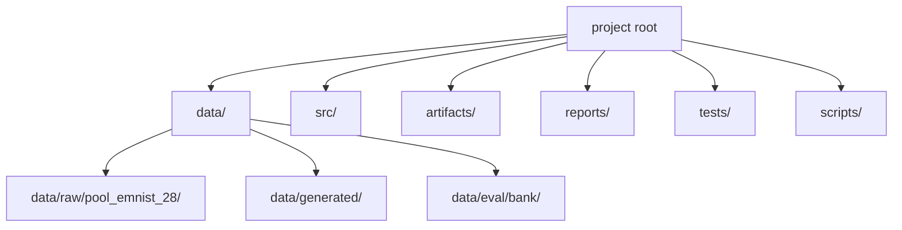

# Development guide

Where the code lives, how to run the tests, and how to extend the pipeline.

---

## Development environment setup

This project has its own dedicated virtualenv. Never use the repo-root `.venv` here.

```bash
cd exploration/handwritten-arithmetic-recognition
./scripts/setup_venv.sh
export PP="$(pwd)"
source .venv/bin/activate
```

`scripts/` contains only `setup_venv.sh`. All data pipeline operations that were previously one-off scripts are now registered CLI subcommands (`prepare-pool-clean`, `prepare-pool-hires`, `render-examples`).

Verify the CLI works:

```bash
PYTHONPATH="$PP" .venv/bin/python -m src --help
```

---

## Folders and Python modules

- **`data/`** — raw crops and generated processed data.
- **`src/`** — all runnable logic (CLI modules live here too).
- **`artifacts/`** — trained weights.
- **`reports/`** — logs, summary markdown, prep CSVs.
- **`tests/`** — `unittest`/`pytest` suite.
- **`scripts/`** — contains only `setup_venv.sh`.
- **`docs/`** — guides; **[docs/architecture.md](docs/architecture.md)** is the system overview including product specification.

---

## Project tree (high level)



---

## `src/` — each package and file

### Root

| File | Role |
|------|------|
| `__main__.py` | Invokes CLI (`python -m src`). |
| `cli.py` | Maps subcommands to `main()` modules. |

### `src/core/`

| File | Role |
|------|------|
| `config.py` | Paths, `DataPrepConfig`, split + image expectations, `resolve_project_root`. |
| `ontology.py` | Label lists, YOLO names, parsing helpers for flattened labels. |
| `artifact_paths.py` | Resolve `best_gnn.pt`, `best.pt`, run dirs, `active.json`. |
| `run_config.py` | Typed config dataclasses for GNN and YOLO training runs. |
| `logging_setup.py` | Per-run file logging setup. |
| `hashing.py` | SHA-based weight fingerprinting for run records. |
| `cluster_metrics.py` | ARI and other cluster quality metrics. |
| `progress.py` | `tqdm` progress wrappers. |

### `src/data_pipeline/`

| File | Role |
|------|------|
| `dataset.py` | Scan `data/raw/pool_emnist_28`, validation, splits, CSV helpers. |
| `image_io.py` | Pillow PNG to `(H,W,1)` uint8. |
| `prepare_stage1.py` | Stage 1 manifest artifacts (called from `validate`). |
| `prepare_stage2.py` | Stage 2 NPZ + manifests (called from `validate`). |
| `prepare_pool_clean.py` | CLI `prepare-pool-clean`: clean and deduplicate the EMNIST crop pool. |
| `prepare_pool_hires.py` | CLI `prepare-pool-hires`: prepare high-resolution crop pool variant. |
| `validate_dataset.py` | CLI `validate`: full prep + prep reports. |
| `validate_yolo_labels.py` | Post-generation YOLO label validation. |
| `prepare_synthetic_yolo.py` | CLI `generate`. |
| `prep_gates.py` | Skip-if-complete checks for processed/synth dirs. |
| `preprocessing.py` | Shared image preprocessing pipeline (grayscale, pad, contrast, stroke normalise). |

### `src/generation/`

| File | Role |
|------|------|
| `layouts.py` | Deterministic layout dispatch; `sample_layout_for_case` (handles 22 SceneCase values). |
| `layouts_types.py` | Layout type definitions and token dataclasses. |
| `layouts_core.py` | Core layout construction primitives. |
| `synth_yolo.py` | Render 512x512 scenes, YOLO labels, ground-truth JSON. |
| `synth_pool.py` | Pool-based crop composition utilities. |
| `completion_stages.py` | Partial-exercise stage sampler (16 stages per SceneCase, mix configurable via `[generation.completion]`). |
| `handwriting_style.py` | Per-scene style: single parameterised preset via `[generation.preset]` (glyph rotation, jitter, broken-stroke probability). |
| `geometry.py` | Per-glyph rotation with tight bbox refit and row baseline tilt. |
| `strokes.py` | Spline-based bar and bracket rendering with y-jitter and thickness variation. |
| `render_examples.py` | CLI `render-examples`: render canonical example scenes for visual inspection. |
| `source_quality.py` | Source pool quality analysis utilities. |

### `src/modeling/`

| File | Role |
|------|------|
| `gnn.py` | `CropBackbone` v2 (6-layer, 128-dim) + `SymbolGNN` (GATv2-based joint classifier/parser). |
| `graph_builder.py` | Builds dense NxN PyG `Data` graphs from YOLO detections and the scene image. |
| `graph_features.py` | Pure helpers: 16-dim geometric edge features and edge-type long tensor. |
| `edge_types.py` | 8-token edge-type vocabulary with O(1) lookup via pre-built dict. |
| `class_weights.py` | Balanced weights for sparse classes (sklearn). |

### `src/training/`

| File | Role |
|------|------|
| `run.py` | CLI `train --stage yolo`: YOLO training loop. |
| `train_gnn.py` | GNN training loop, dataset, and checkpointing. |

### `src/inference/`

| File | Role |
|------|------|
| `run.py` | CLI `infer`: YOLO or fallback components to GNN to JSON. Emits `truncated`/`max_nodes_cap` when N > 80. |
| `cv_fusion.py` | Complementary classical-OpenCV detector (connected components plus optional second YOLO pass) that recovers symbols YOLO misses on unfinished scenes; masks YOLO ink, reclassifies crops, NMS-merges, surfaces results to the GUI. |
| `gui.py` | CLI `gui` (Gradio). |
| `gui_components.py` | HTML panel renderers for Stage 1, Stage 2, result, and status. |
| `annotation.py` | Colour helpers and coarse-class mapping for GUI overlays. |
| `gt_loader.py` | Load GT JSON, IoU-match predictions, compute scene scores. |
| `showcase.py` | Showcase tab + standalone input/results pages. Pipeline execution + page UI for data-collection during demos. |
| `showcase_store.py` | Pure I/O layer (no Gradio deps) for persisting showcase sample outcomes to `data/generated/showcase/<run_id>/`. |

### `src/parsing/`

| File | Role |
|------|------|
| `detection.py` | `Detection` dataclass for bboxes. |
| `assemble.py` | Pure JSON formatter: converts `NodePrediction` objects to structured output (no spatial logic). OOD gate constants live here. |
| `match_tokens.py` | IoU + greedy matching. |
| `equation_display.py` | Human-readable formatting (GUI). |

### `src/eval/`

| File | Role |
|------|------|
| `labels.py` | Label sidecar schema and loader. Defines `SymbolLabel`, `SampleLabel`, `EQUATION_KINDS`, and `load_label_sidecars()`. |
| `harness.py` | Harness core. Defines `SampleMetric`, `AggregateMetric`, `RunRecord`, and the public functions for running the pipeline bank, writing JSONL, loading baseline records, and rendering markdown. |
| `run.py` | CLI `eval` subcommand: runs the harness over `data/eval/bank/` and appends to `reports/eval/history.jsonl`. |

---

### `src/grading/`

Feedback-demo integration (the grading engine behind the `demo` web app).

| File | Role |
|------|------|
| `types.py` | Frozen dataclasses for the grading engine contract (grid tokens, eval elements/result, exercise spec) with `from_api`/`to_api`. |
| `client.py` | The `GradingClient` Protocol and `make_client()` factory; selects mock or http by `[grading] mode`. |
| `mock_client.py` | High-fidelity in-process grader. Structure-relative and answer-first: a correct answer grades correct regardless of placement; carry, borrow, and partial-product steps are graded on presence only; emits one feedback verdict. |
| `derive.py` | The auto-deriver: `derive_exercise(spec, create_view_model, solution_data) -> BankExercise` builds the full expected-token layout for any exercise from the grading engine's `session/create` plus `session/solution` responses, working in the translation-invariant native solution frame so no cell coordinates are hand-mapped. |
| `exercises.py` | Owns the shared `ExpectedToken` / `BankExercise` contract, the CMS-UUID exercise stubs (`list_cms_exercises`), `expected_tokens_as_grid`, and the validated spec builder. The static hand-written bank and per-exercise builders were removed; layouts are now produced by `derive.py`. |
| `grid_mapping.py` | The single pixel to engine-grid transform; maps recognizer bboxes to grid cells and back for scaffold and feedback placement. |

---

### `src/demo/`

The `demo` CLI subcommand: a FastAPI plus Konva web app that connects the recognizer to grading engine.

| File | Role |
|------|------|
| `app.py` | `create_app()` and `main()`; routes for the exercise bank, select, evaluate, and score; injects the grading engine client and inference session via `app.state`. |
| `session.py` | The single in-memory demo session (active exercise, engine session, calibration). |
| `static/` | Vanilla JS plus Konva frontend (`index.html`, `app.js`, `app.css`, vendored `konva.min.js`): draw canvas with pen and eraser, model-first recognition overlay, one-verdict feedback, and a guide grid. |

---

## Running tests

```bash
export PP="$(pwd)"
PYTHONPATH="$PP" .venv/bin/python -m pytest tests/ -q
```

Expected: about 1440 passed (1442 collected), plus environment-gated skips, with 4 deselected (the `-m eval` regression gate).

The `eval` marker tests require `reports/eval/history.jsonl` to exist (produced by `python -m src eval`). They are excluded from the default run via `addopts = "-m 'not eval'"` in `pyproject.toml`:

```bash
PYTHONPATH="$PP" .venv/bin/python -m pytest tests/ -m eval
```

---

## Code style and preferred patterns

- All runnable logic lives in `src/`. No business logic outside `src/`.
- No hardcoded paths. Use `resolve_project_root()` from `src/core/config.py`.
- No labels outside `src/core/ontology.py`. Any label change must go there first, then re-run `validate` and retrain.
- No tuning against the test set; val split only.
- Type-annotate public functions. Keep modules single-purpose (one file, one responsibility).
- Config-driven: all tunable parameters live in `config.toml`. No magic numbers in code.

---

## Adding new code

### New symbols/labels

1. Edit `src/core/ontology.py`.
2. Add crop folders under `data/raw/pool_emnist_28/`.
3. Run `validate`.
4. Retrain GNN.

### New layouts

1. Add layout function to `src/generation/layouts.py` (or `layouts_core.py`).
2. Add new `SceneCase` value to `src/generation/layouts_types.py` and dispatch in `sample_layout_for_case` in `layouts.py`.
3. Add valid stages in `src/generation/completion_stages.py`.
4. Update `config.toml [generation.case_weights]` if the new case should have a multiplier.
5. Retrain Stage 1 and GNN.

All 22 cases are currently implemented: 7 base (addition, subtraction, multiplication-simple, multiplication-multi, division-short, division-long, division-simple), 9 variants (op_right, no_bar, heavy_borrow, dense_carries), 4 isolation cases (bare_digits, bare_digit_grid, standalone_bar, standalone_bracket), and 2 crowded cases (addition_crowded_carry, subtraction_crowded_borrow).

### Domain shift (camera, different pen width)

Regenerate synthetic data with matching augmentation parameters (adjust `config.toml [generation.preset]` for per-glyph variance; adjust `[generation.rendering]` for stroke widths and gaps), then fine-tune GNN on new scenes.
