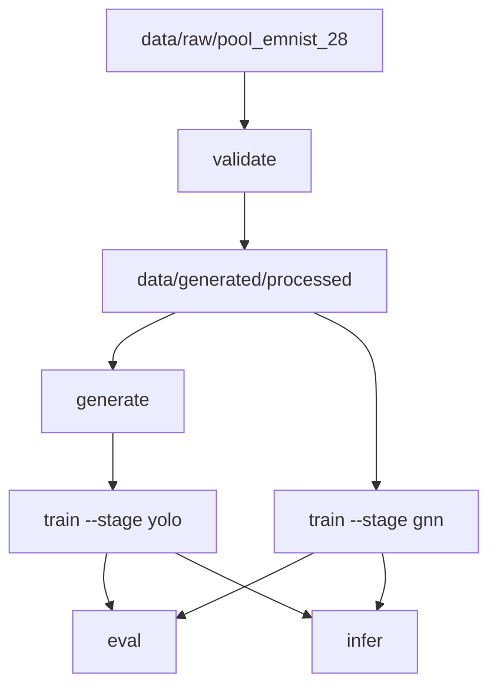

# Runbook

## Quickstart

If you want to (re)train: prep → (optional) synth → train → eval. If you only want inference: use the bundled weights and run `infer`.

```bash
./scripts/setup_venv.sh
export PP="$(pwd)"
PYTHONPATH="$PP" .venv/bin/python -m src --help
```

## Diagram



---

## Data prep

**Important:** This section describes retraining on synthetic data. If you only want to collect
real scenes and fine-tune, skip `validate` and `generate`; see "Setmaker — building real eval and
train sets" below and `prepare-realtrain` in the Training section.

### What `validate` does

`validate` turns the raw crop pool into processed artifacts for both training stages. It requires
the symbol pool at `data/raw/pool_emnist_28/` (or the configured source in `config.toml`):

1. **`prepare_stage1`** — builds Stage 1 artifacts (including `symbol_assets_manifest.csv`: path, label, split, glyph/yolo columns).
2. **`prepare_stage2`** — scans images, quality gates, stratified splits, writes manifests and `arrays/{train,val,test}.npz` (28×28 float crops + labels + `image_id`).
3. **Reports** under `reports/prep/` (class distribution, split leakage, issues).

```bash
export PP="$(pwd)"
PYTHONPATH="$PP" .venv/bin/python -m src validate --project-root "$PP"
```

Tunable mainly via **`DataPrepConfig`** in [`src/core/config.py`](../src/core/config.py): `split_ratios`, `random_seed`, `expected_size` / `expected_channels` / `expected_extension`, optional strict ontology via `validate --require-full-role-ontology`.

---

## Synthetic generation

Synthetic YOLO scenes are needed only to train Stage 1 (YOLO). The GNN also trains on these scenes via the graph builder.

```bash
PYTHONPATH="$PP" .venv/bin/python -m src generate --project-root "$PP"
```

All generation options (images per case, split ratios, scene variance, rendering knobs, etc.) are set in `config.toml [generation]` and related blocks. No CLI flags are needed beyond `--project-root`.

### How synthetic images are built

Entry: [`synth_yolo.py`](../src/generation/synth_yolo.py) via [`prepare_synthetic_yolo.py`](../src/data_pipeline/prepare_synthetic_yolo.py).

1. Read **`symbol_assets_manifest.csv`** (per-split rows with `glyph_key` for pooling variants like `main_7` vs `carry_7`).
2. For each scene, pick a random equation using [`layouts.py`](../src/generation/layouts.py) (20 scene cases: 7 base + 9 operator/bar layout variants + 4 isolation cases `bare_digits`, `bare_digit_grid`, `standalone_bar`, `standalone_bracket`; see `[generation.case_weights]` in config.toml).
3. Layout emits **`LayoutToken`** list (row/col, flattened label, YOLO coarse class name, scale for carry/borrow).
4. Tiles are **28×28** PNGs scaled into grid cells; result bar drawn programmatically; canvas default **512×512**.
5. Writes: `images/*.png`, YOLO `labels/*.txt`, optional `ground_truth/*.gt.json`, split manifests.

A 5-module layer stack controls visual variation: `completion_stages` (configurable mix: default 57% full / 43% partial; see `[generation.completion]`), `handwriting_style` (single parameterised preset via `[generation.preset]`: rotation, jitter, stroke width, broken stroke disabled), `geometry` (per-glyph rotation + row baseline tilt), `strokes` (spline-based bar/bracket rendering with y-jitter), and post-processing (stroke-width normalisation, contrast enhancement). Scope is tablet-only: no paper textures, shadows, JPEG compression, or scene-level rotation. Output lands in `data/generated/synthetic/`.

### Generation config keys

| Key | Section | Effect |
|-----|---------|--------|
| `images_per_case` | `[generation]` | Base count per scene type |
| `split_train/val/test` | `[generation]` | Train/val/test split ratios |
| `min_source_quality` | `[generation]` | Optional quality gate (0.0 = disabled) |
| per-case multipliers | `[generation.case_weights]` | Case-specific image count scaling (1.0–2.0) |
| completion stage mix | `[generation.completion]` | Full vs partial exercise ratio (sum = 1.0) |
| scene variance | `[generation.scene]` | wrong_result_prob, missing_structural_prob, crowdness, rotation |
| glyph morphology | `[generation.preset]` | Rotation range, jitter, broken stroke probability |
| rendering knobs | `[generation.rendering]` | 29 parameters: glyph scales, stroke gaps, bar/bracket jitter, error modes |

---

## Training

### Which dataset for which stage

| Stage | Training input | Source |
|-------|----------------|--------|
| **GNN** | Scene graphs from `data/generated/synthetic/` | Built by `generate` and graph builder in `src/modeling/graph_builder.py`. |
| **Stage 1 (YOLO)** | `data/generated/synthetic/<run_id>/{train,val,test}/` (images + YOLO labels) | Built by `generate` from manifest + `layouts`. |

### Train commands

```bash
PYTHONPATH="$PP" .venv/bin/python -m src train --project-root "$PP" --stage gnn
PYTHONPATH="$PP" .venv/bin/python -m src train --project-root "$PP" --stage yolo
```

Training writes `run.log`, `run.json`, and `eval.md` into the run artifact folder. `run.json["metrics"]` has `"val"` and `"test"` keys.

### GNN hyperparameters

| Param | Default | Meaning |
|-------|---------|---------|
| `epochs` | 60 | Max epochs before forced stop |
| `batch_size` | 32 | Scenes per gradient update |
| `lr` | 0.001 | Initial learning rate |
| `early_stop_patience` | 8 | Epochs without val improvement before stop |
| `dropout` | 0.2 | Fraction of features randomly zeroed during training |
| `weight_decay` | 0.0001 | L2 regularization coefficient |
| `temperature` | 0.1 | Temperature for NT-Xent contrastive loss (row/col clustering) |

All GNN knobs live in `config.toml [gnn]` and `[gnn.loss_weights]`.

### YOLO hyperparameters (CLI overrides)

| Flag | Effect |
|------|--------|
| `--epochs` | Max epochs (overrides `config.toml [yolo] epochs`). |
| `--image-size` | Should match synthetic canvas (512). Wrong size → train/infer mismatch. |
| `--batch` | Override batch size from config.toml. |
| `--workers` | Dataloader parallelism; reduce on macOS if unstable. |
| `--device` | `cpu` / `mps` / `0` for CUDA. |

All other YOLO knobs (`optimizer`, `lr0`, `lrf`, `momentum`, `weight_decay`, `warmup_epochs`, `box`, `cls`, `dfl`, `amp`) live in `config.toml [yolo]`.

### GNN warm-start / fine-tuning (since iter9)

When fine-tuning a GNN from a prior checkpoint (e.g. after data augmentation or architectural experiment), use the `--init-from` flag to load weights from an earlier run. Read the current run id from the active pointer rather than hard-coding a literal that may have been rotated out:

```bash
# Use the current active GNN run id (preferred):
INIT_FROM="$(python -c 'import json; print(json.load(open("artifacts/gnn/active.json"))["run_id"])')"
PYTHONPATH="$PP" .venv/bin/python -m src train --project-root "$PP" --stage gnn \
  --init-from "$INIT_FROM" \
  --lr 0.0005

# Or warm-start from the retained reference run 20260525T224459Z_a7fd6e8f.
```

- `--init-from <run_id>` loads `artifacts/gnn/runs/<run_id>/best.pt` with `strict=False`, allowing partial weight loading when architectures differ slightly.
- `--lr FLOAT` (optional) overrides the learning rate from `config.toml [gnn] lr` for lower fine-tuning rates (e.g., 0.0005 instead of 0.001).
- The checkpoint metadata will include `run_type: "finetune"` and `init_from_run_id` in the run manifest.

**Important:** From-scratch training wins when the synthetic distribution changes substantively (iter10-R6 synth pipeline fixes C-1..C-4 demonstrated this). Warm-start from prior runs only when the synthetic pipeline is stable. If distribution changes, retrain from scratch.

---

## Setmaker — building real eval and train sets

Setmaker is a local offline FastAPI + Konva.js web tool that automates the tedious parts of building real data:

1. Auto-generates a clean target equation (typeset reference).
2. Human redraws the equation on a web canvas.
3. YOLO detects bounding boxes.
4. Hungarian matcher copies fine labels from the known target geometry to the detected boxes (DRY).
5. Human reviews and fixes only the flagged boxes (not all 80+).
6. Exports: eval mode → `data/eval/real/<stem>.png` + `.label.json`; train mode → `data/setmaker/train/` with YOLO `.txt` labels.

Smart worklist planner: eval mode prioritizes deficit-driven selection (which equation types the eval bank needs), train mode gaps selection (which `scene_case` values need more density from eval metrics). Durable seed state in `data/setmaker/state/` — each session serves a new, deterministic target. Quota is `data/setmaker/quota.json`.

```bash
PYTHONPATH="$PP" .venv/bin/python -m src setmaker --project-root "$PP"
```

Optional flags:

| Flag | Default | Purpose |
|------|---------|---------|
| `--port` | 8001 | Web server port |
| `--host` | 127.0.0.1 | Bind address (0.0.0.0 for network access) |
| `--mode` | eval | Mode: `eval` (outputs to `data/eval/real/`) or `train` (outputs to `data/setmaker/train/`) |
| `--project-root` | auto-resolved | Project root for quota and state |

---

## Inference

### One image → JSON

```bash
PYTHONPATH="$PP" .venv/bin/python -m src infer \
  --project-root "$PP" \
  --image "/path/to/image.png" \
  --output-json "$PP/reports/infer.json" \
  --cv-fusion auto
```

### Inference knobs

| What | Where | Effect |
|------|--------|--------|
| YOLO confidence | `--yolo-conf` on `infer` | Higher → fewer boxes, fewer false positives; may miss symbols. |
| CV fusion | `--cv-fusion on\|auto\|off` on `infer` | Overrides `config.toml [inference.cv_fusion] mode` for this run. |
| Fallback | omit `--stage1-weights` | Always components-based proposals; different error profile. |
| NMS IoU | `config.toml [yolo.inference] iou` | Default 0.3; stricter dedupe of scale-variant duplicates. |

### CV fusion (component proposals + YOLO)

CV fusion supplements the YOLO detector with classical connected-component proposals so faint or under-detected real handwriting still produces boxes. The `--cv-fusion` flag selects the mode for a single run; the persistent default and all tuning knobs live in `config.toml [inference.cv_fusion]` (see config-rationale.md for the full per-knob rationale):

| Mode | Behaviour |
|------|-----------|
| `on` | Always run the component-proposal pass and merge it with YOLO detections. |
| `auto` | Run the component pass only when YOLO output looks weak: fewer than `gate_min_detections` (6) boxes or mean confidence below `gate_mean_conf` (0.6). |
| `off` | YOLO detections only; no component fusion. |

Key gating and pass knobs in `config.toml [inference.cv_fusion]`: `gate_min_detections` (6) and `gate_mean_conf` (0.6) decide when `auto` triggers; `use_second_yolo_pass` (false) optionally re-runs YOLO at `second_pass_conf` (0.15) on a masked crop; `classify_conf` (0.25) is the floor for accepting a YOLO label on a fused component, with `keep_unclassified` (false) controlling whether unlabelled proposals are retained under `fallback_label` (`digit_main`); when enabled, retained proposals must also clear the `keep_min_ink_frac` (0.10) ink-density floor. The full set of mask, merge, and letterbox knobs is documented in config-rationale.md.

---

## GUI

Everything below runs from the **project root** — the folder that contains `data/`, `src/`, `artifacts/`, and `requirements.txt`.

```
exploration/handwritten-arithmetic-recognition/   <- this is the project root
```

### Prerequisites

- Python 3.12
- The project's local virtualenv (`.venv/`)
- Trained model weights in `artifacts/` (already present if you unzipped the submission)

### Step 1 — Set up the virtualenv (one time only)

```bash
cd exploration/handwritten-arithmetic-recognition
./scripts/setup_venv.sh
```

This creates `.venv/` and installs everything in `requirements.txt`, including PyTorch, PyTorch Geometric, Ultralytics (YOLO), and Gradio.

### Step 2 — Verify the trained weights exist

```bash
ls artifacts/yolo/best.pt          # YOLO detector
ls artifacts/gnn/best.pt           # GNN (SymbolGNN)
```

Both files must be present. If they are missing, run the full training pipeline first — see the Data prep and Training sections above.

### Step 3 — Launch the GUI

```bash
PYTHONPATH="$(pwd)" .venv/bin/python -m src gui
```

Gradio starts and prints:

```
Running on local URL:  http://127.0.0.1:7860
```

Open that URL in your browser.

#### Optional flags

| Flag | Default | Purpose |
|---|---|---|
| `--port 7861` | 7860 | Use a different port (e.g. if 7860 is taken) |
| `--host 0.0.0.0` | 127.0.0.1 | Make it reachable on your local network |
| `--share` | off | Create a temporary public Gradio link |
| `--stage1-weights path/to/best.pt` | auto-resolved | Override the YOLO weights path |
| `--gnn-model path/to/best.pt` | auto-resolved | Override the GNN weights path (`artifacts/gnn/best.pt`) |

### Step 4 — Use the UI

1. **Load models** — click the "Load models" button (paths are pre-filled from `artifacts/`). The status bar shows "Models loaded" when ready.
2. **Draw** — sketch a handwritten arithmetic expression on the canvas (e.g. `25 + 37` with a carry mark above).
3. **Read the output** — the right panel shows:
   - **Recognized (readable)** — human-readable equation layout
   - **Recognized (JSON)** — full structured output with rows, columns, roles
   - **Timings** — per-stage latency breakdown (Stage 1 ms, GNN ms)

#### Mode

| Mode | Behaviour |
|---|---|
| **Live** | Runs inference automatically as you draw (rate-limited to ~1 run/s) |
| **Manual** | Click "Recognize" to trigger inference once |

#### yolo-conf slider

Controls the minimum confidence YOLO needs before keeping a detection box. Lower = more boxes (catches faint symbols, but also noise). Higher = only high-certainty detections. Default is `0.25`.

### Troubleshooting

**Port already in use**

```bash
lsof -ti :7860 | xargs kill -9
# then re-run the launch command
```

**"Models are not loaded yet"**

Click the "Load models" button in the sidebar before drawing.

**YOLO not installed / fallback mode**

If `ultralytics` is missing, Stage 1 falls back to a pixel blob-finder. Install it with:

```bash
.venv/bin/pip install ultralytics
```

**Blank output after drawing**

Switch to Manual mode and click "Recognize". Live mode has a rate-limit — if you draw faster than ~1 stroke per second it waits.

---

## Evaluation

The `eval` command runs the full two-stage pipeline over a sample set and appends a structured result record to `reports/eval/history.jsonl`. It also renders a human-readable summary to `reports/eval/latest.md`.

The default target is the fixed 37-scene eval bank at `data/eval/bank/`, which is retained for regression gating despite its addition skew:

```bash
PYTHONPATH="$PP" .venv/bin/python -m src eval --project-root "$PP"
```

The primary measurement set is the 190-scene real eval set (`data/eval/real/`, not included in this repository). Point `eval` at it with `--samples-dir` and tag the run with `--config-id` so the record is distinguishable in the history:

```bash
PYTHONPATH="$PP" .venv/bin/python -m src eval --project-root "$PP" \
  --samples-dir data/eval/real --config-id real
```

To compare a fresh run against the baseline without modifying active.json (iter11 NEW: run-id override flags):

```bash
PYTHONPATH="$PP" .venv/bin/python -m src eval --project-root "$PP" \
  --yolo-run-id <yolo_run_id> --gnn-run-id <gnn_run_id>
```

The `equation_kind_acc` floor is 0.70. The pytest regression gate reads the latest record and fails if the floor is breached:

```bash
PYTHONPATH="$PP" .venv/bin/python -m pytest tests/ -m eval
```

---

## Preprocessing pipeline

All images — whether drawn on the tablet canvas, uploaded as a file, or generated synthetically — pass through a single shared preprocessing pipeline before reaching any model. The pipeline lives in `src/data_pipeline/preprocessing.py` and is the **single source of truth** for image normalisation.

**Ordered stages:**

1. **Grayscale + alpha-composite onto white** — RGBA is composited; RGB and L are converted to L.
2. **Resize longest-edge to 512 + white-pad to 512×512** — maintains aspect ratio; padding is symmetric white (255), never gray.
3. **Contrast normalisation** — 1st–99th percentile of pixel values stretched to [0, 255]. Handles tablet canvas brightness drift without thresholding.
4. **Stroke-width normalisation** — estimates current stroke width via distance transform on ink mask (pixels < 200); dilates or erodes to match 2 px target. Suppresses speckle via morphological open before dilating.

`build_graph` in `src/modeling/graph_builder.py` asserts `gray.shape == (512, 512)` at entry, so any caller that skips preprocessing fails loudly rather than silently drifting feature values.

**Entry points that call the preprocessor:**
- `src/inference/gui.py:_extract_gray` — Gradio Sketchpad draw path
- `src/inference/gui.py:on_file_load` — file upload path
- `src/inference/run.py:_load_image_gray` — CLI single-image inference
- `src/generation/synth_yolo.py:build_synthetic_yolo_dataset` — synthetic YOLO scene generation (preprocessed at write time, so training images are already 512×512 on disk)

---

## CLI reference

### Convention
```bash
export PP="$(pwd)"
PYTHONPATH="$PP" .venv/bin/python -m src --help
```

### Commands

| Command | Description |
|---------|-------------|
| `validate` | Build processed artifacts and prep reports |
| `generate` | Generate synthetic YOLO scenes (only for Stage 1 training) |
| `train` | Train a model: `--stage yolo` or `--stage gnn` |
| `infer` | Run one image through the full pipeline and emit JSON; `--cv-fusion on\|auto\|off` selects component fusion |
| `gui` | Launch optional Gradio UI |
| `eval` | Runs structured pipeline evaluation; default target `data/eval/bank/`, or `--samples-dir data/eval/real --config-id real` for the 190-scene real set; appends to `reports/eval/history.jsonl` |
| `prepare-realtrain` | Merge real set-maker train output with synthetic into a fine-tune dataset |
| `render-examples` | Render canonical example scenes for visual inspection |
| `prepare-pool-clean` | Clean and deduplicate the EMNIST crop pool |
| `prepare-pool-hires` | Prepare high-resolution crop pool variant |

For flags, run `... <command> --help`.

## Fine-tuning with real data

Once teammates have drawn real training scenes in the set-maker (train mode), the output lands
in `data/setmaker/train/` as `<stem>.png` + `<stem>.gt.json` + `<stem>.txt`. That output is not
read by the trainers directly; bridge it with `prepare-realtrain`, then fine-tune.

```bash
# 1. Build the merged real+synthetic dataset (real oversampled; val/test stay synthetic)
PYTHONPATH="$PP" .venv/bin/python -m src prepare-realtrain --project-root "$PP"
#    Optional: --real-oversample N   (repeat each real scene N times against the synthetic set)

# 2. Warm-start fine-tune from the current active weights (low LR). The --finetune-from-real
#    flag points the trainer at the merged dataset; without it, training stays synthetic-only.
PYTHONPATH="$PP" .venv/bin/python -m src train --project-root "$PP" --stage gnn  --finetune-from-real --init-from <active_gnn_run> --lr 0.0005
PYTHONPATH="$PP" .venv/bin/python -m src train --project-root "$PP" --stage yolo --finetune-from-real

# 3. Re-measure against the real eval set and compare to the prior baseline
PYTHONPATH="$PP" .venv/bin/python -m src eval --project-root "$PP" --samples-dir data/eval/real --config-id real
```

Validation and test splits stay synthetic so the held-out measurement remains comparable across
runs. The active run IDs to warm-start from are in `artifacts/gnn/active.json` /
`artifacts/yolo/active.json` (see `docs/runs.md`).

Known transient state: after a SceneCase is added (the `bare_digit_grid` case is the latest),
four `tests/generation/test_render_examples.py` tests fail until the example gallery is
regenerated with `python -m src generate && python -m src render-examples`. This is expected,
not a code defect, and regeneration happens as part of preparing a training run.
